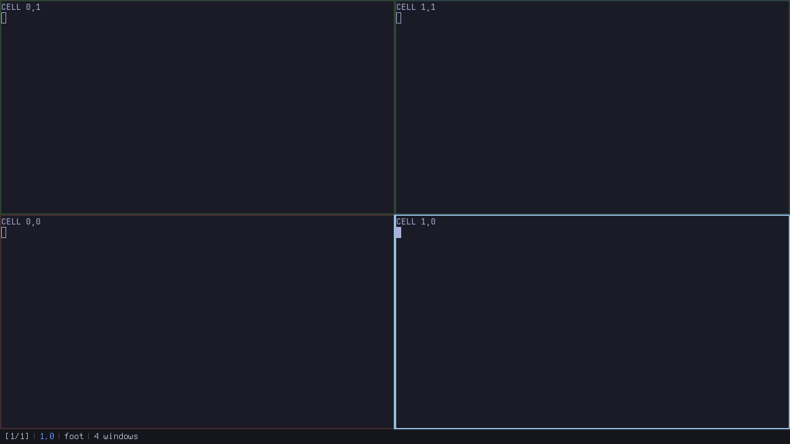
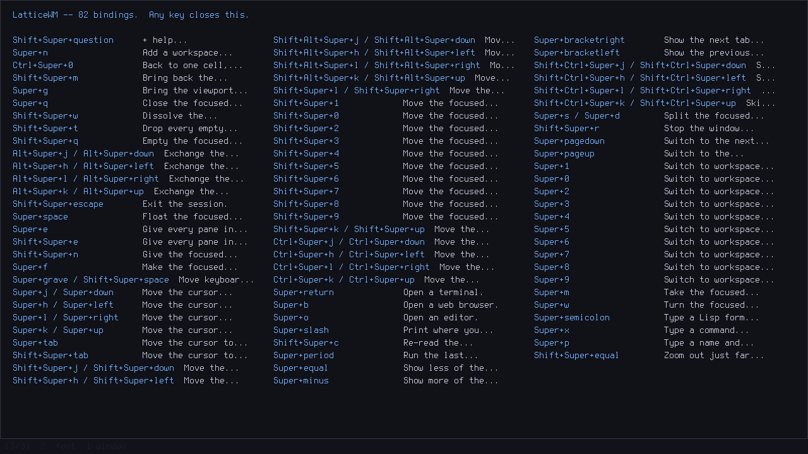
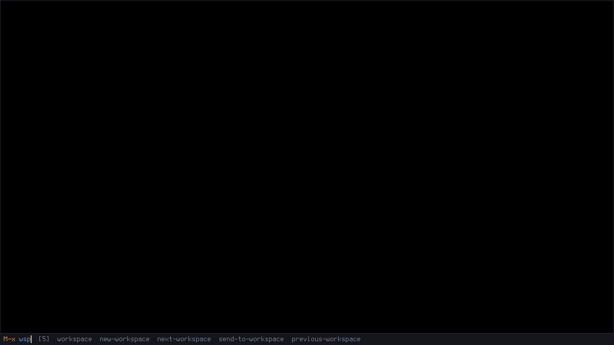
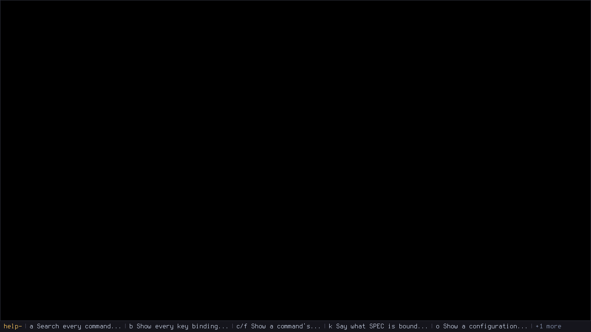
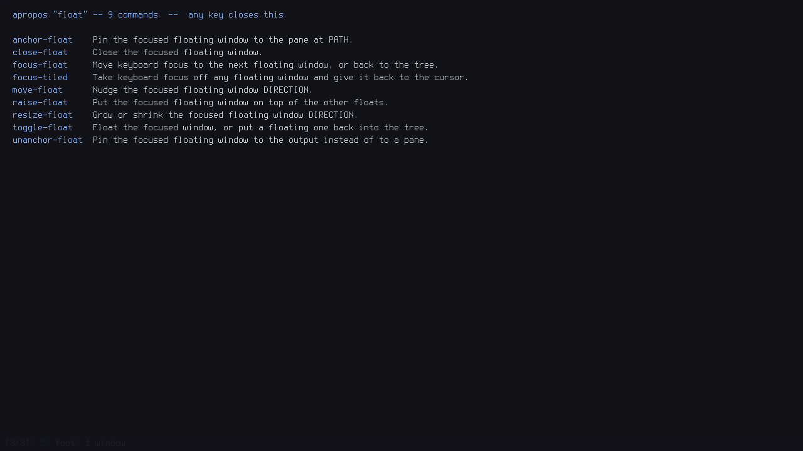
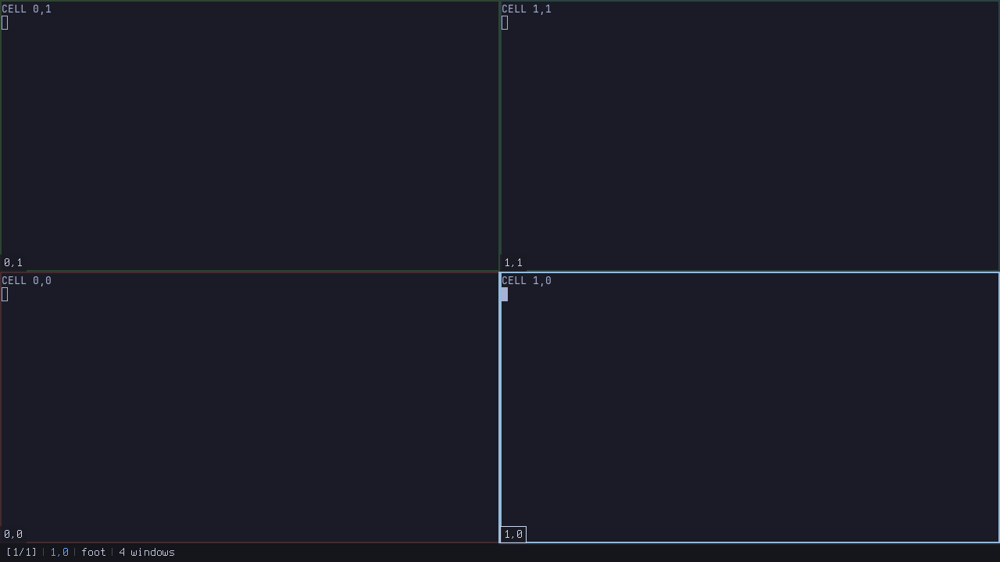
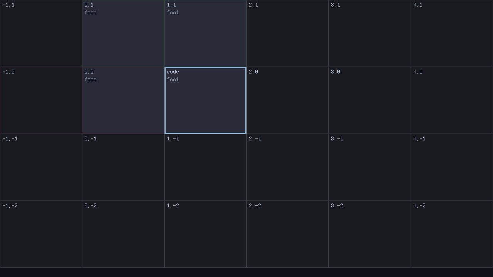

#+TITLE: LatticeWM
#+AUTHOR: Shaul Khayyat
#+OPTIONS: toc:2 num:nil

An extensible window manager for the [[https://codeberg.org/river/river][river]] Wayland compositor, written in Common
Lisp, whose layout model is a *replaceable policy layer* rather than the program
itself.

It tiles the way you expect — recursive splits, tabs, workspaces, floating,
multi-monitor — and then lets you change any of it while it is running, without
a restart and without a rebuild.

#+begin_quote
There has never been a Common Lisp Wayland window manager. This is one.
#+end_quote

* Install

You need *river 0.4.x* and *SBCL*. Any Linux — nix is one supported route, not
a requirement. Per-distribution package names are in [[file:INSTALL.org][INSTALL.org]].

#+begin_src sh
git clone https://github.com/SYKhayyat/LatticeWM && cd LatticeWM
./bootstrap.sh     # fetch the Lisp dependencies into ./.deps/   (or: nix-shell)
make               # build, six gates, 570 tests
make run           # river nested in the session you are already in — try it here first
#+end_src

Once you like it:

#+begin_src sh
./install.sh       # binary, a session entry, a launcher and a man page
#+end_src

=install.sh= adds a =wayland-sessions= desktop entry, so *LatticeWM appears at
your login screen* like any other desktop. =--prefix /usr/local= installs
system-wide; =--uninstall= takes it back out. It never overwrites an existing
=init.lisp=.

In a session you are already running river in: =river -c latticewm=.

* The first thing to press

*=Super+/=* draws the entire keymap on screen, with what each binding does —
built from the *live* bindings and each command's own docstring, so it includes
anything you bound five minutes ago and it cannot go stale.

You will also get a short *welcome overlay the first time it starts*, listing
the half-dozen keys that matter. Any key dismisses it, it never appears again,
and =M-x welcome= brings it back. To stop it appearing at all:

#+begin_src lisp
(setf *welcome-on-first-run* nil)   ; in ~/.config/latticewm/init.lisp
#+end_src

* Keys

Every binding below is generated from =*modifier*=, which defaults to =Super=.
Change that one value and the whole keymap moves with it.

Both the vi letters and the arrow keys are always bound. That is deliberate
rather than indecisive: the arrows are what you use on your first day and the
letters are what you use on your hundredth.

** Panes

| =Super+Return=          | a terminal                                  |
| =Super+d=               | split horizontally                          |
| =Super+s=               | split vertically                            |
| =Super+q=               | close the window                            |
| =Super+h j k l= / arrows | move focus left, down, up, right           |
| =Super+Tab=             | focus the next pane (=Shift= for previous)  |
| =Shift+Super+h j k l=   | move the window                             |
| =Ctrl+Super+h j k l=    | resize                                      |
| =Alt+Super+h j k l=     | swap with the neighbour                     |
| =Super+e=               | equalize this container (=Shift= for all)   |
| =Shift+Super+q=         | clear the pane                              |

** Windows

| =Super+Space=       | float this window / put it back      |
| =Super+`=           | focus the floating layer             |
| =Super+f=           | fullscreen                           |
| =Super+m=           | minimize (=Shift+Super+m= restores)  |
| =Super+w=           | tab this pane (=Shift+Super+w= untabs) |
| =Super+[= / =Super+]= | previous / next tab                 |

Minimize leaves the tiling tree rather than collapsing it, so restoring puts
the window back where it was.

** Workspaces

| =Super+1= … =Super+0=       | go to workspace 1–10        |
| =Shift+Super+1= … =Shift+Super+0= | send this window there |
| =Super+n=                   | a new workspace             |
| =Super+PageUp= / =PageDown= | previous / next workspace   |

Workspaces are one-based, so the key and the number on it agree.

** Launching

| =Super+Return= | =*terminal*= (default =foot=)   |
| =Super+b=      | =*browser*= (default =firefox=) |
| =Super+o=      | =*editor*= (default =emacs=)    |

* Asking it things

This is the half of Emacs that is not the keybindings. Every command is named,
documented, and reachable:

| =Super+/=   | the whole keymap, drawn from the live bindings              |
| =Super+x=   | run any command by name — including ones that take arguments, which it asks for |
| =Super+;=   | evaluate a Lisp form inside the running window manager       |
| =Super+.=   | do that again, with the same arguments                      |
| =Super+? k= | what does this key do?                                      |
| =Super+? a= | is there a command for …? — searches every docstring        |
| =Super+? c= | show a command's documentation and the keys that run it     |
| =Super+? o= | what is this setting, what did it ship as, and why          |
| =Super+? s= | change a setting, now, without a file or a restart          |

Pressing a chord's first key lists what the second can be. Completion is
prefix, then substring, then subsequence — so =wsp= finds =send-to-workspace=.
The prompt has a point, a history ring and the readline keys, because a prompt
you can only backspace out of is one you stop using.

|  |  |
|  |  |

* The lattice

Optional, and off by default. Add to =~/.config/latticewm/init.lisp=:

#+begin_src lisp
(asdf:load-system "lattice")
(lattice:enable)
#+end_src

Each workspace becomes an *infinite plane of cells* addressed by integer
coordinate. Zoom is the choice of how many cells you can see — 1, 2, 4, 6, 8 —
and past that it becomes a drawn map. Motion runs straight through a cell
boundary as though it were not there.

|  |  |

The lattice is the project's own experiment on itself: it is a *separate ASDF
system* that depends on the policy package and nothing else, and a CI gate
asserts on every build that it touches no core file. What that cost is written
up in [[file:FINDINGS.org][FINDINGS.org]] — read that first if you want to know whether the premise
holds.

* Configuring it

#+begin_src sh
latticewm --write-config      # a commented starter ~/.config/latticewm/init.lisp
latticewm --list-options      # every setting, its value, its default, and why
latticewm --list-keys         # every binding
latticewm --list-commands     # every command
#+end_src

Anything you can set in the file you can also set live with =Super+? s=, and
=Shift+Super+c= reloads the file without restarting.

** Fonts

It ships with Terminus, and it will use any PSF console font — which means the
few dozen already under =/usr/share/kbd/consolefonts/= on your machine, with
nothing to find, convert or install.

: M-x load-font  /usr/share/kbd/consolefonts/ter-124n.psf.gz

That takes effect immediately. To make it stick, or to use different fonts in
different places:

#+begin_src lisp
(register-font (load-psf "/usr/share/kbd/consolefonts/ter-124n.psf.gz"))
(setf *ui-font* "ter-124n")

;; Or per role — :echo, :minibuffer, :help, :hint, :overlay, :map.
(defmethod font-for ((policy conventional-policy) (role (eql :map)))
  (find-font "ter-112n"))
#+end_src

Widths up to sixteen pixels and any height. =(font-names)= lists what is
registered.

* Extending it

The point of the project. Changing behaviour means writing one =defmethod= in
your own file — no core edit, no rebuild, and it takes effect immediately:

#+begin_src lisp
(defmethod p:gaps ((policy p:conventional-policy) container) 8)
#+end_src

#+begin_src sh
latticewm --extension-surface   # every generic you can specialize, from the running image
#+end_src

Four worked examples are in =examples/=, including a whole alternate layout
model in one method and a new *container kind* — niri's scrolling strip — in
sixty lines. [[file:doc/EXTENDING.org][doc/EXTENDING.org]] walks through them.

=tools/wmeval= evaluates a form inside the running window manager from a shell,
CI, or an agent, over SWANK's wire protocol and without Emacs:

#+begin_src sh
wmeval '(length (all-windows))'
wmeval '(setf *gaps* 8)' '(relayout :force t)'
#+end_src

* Development

#+begin_src sh
make          # build, gates, tests
make test     # the unit suite alone
make run      # river nested inside your current session
make image    # dump ./latticewm
make surface  # regenerate the docs under doc/
#+end_src

Six CI gates run on every build: zero compiler warnings under =safety 3=; every
policy generic documented; the lattice touching no core; the core running with
the lattice absent; codegen counts matching the pinned protocol XML; and the
runtime-to-policy line ratio, reported as a number rather than pass/fail. The
reasoning behind each is in [[file:PLAN.org::#gates][PLAN.org §gates]].

* Documentation

- [[file:INSTALL.org][INSTALL.org]] — installing on any distribution
- [[file:doc/EXTENDING.org][doc/EXTENDING.org]] — how to change it, with worked examples
- [[file:FINDINGS.org][FINDINGS.org]] — what building the lattice from outside the core actually cost
- [[file:DESIGN.org][DESIGN.org]] — the full design record and the reasoning behind every decision
- [[file:PLAN.org][PLAN.org]] — the execution plan and the log of what actually happened

* Status

Working, and used on bare metal. Not yet announced.

Verified on real hardware: keybindings including shifted keys, the minibuffer,
spawning, closing, splits, floating, the empty-pane spawn, persistence, and
the lattice — walking cell to cell across an infinite plane, carrying windows
between cells, and zooming out to a grid.

*Multi-monitor is the exception.* It is written and has never been executed
against a second display. [[file:PLAN.org::#log7][PLAN.org §log7]] is the current list of what is
verified and what is merely written.

* License

GPL-3.0-or-later. See [[file:LICENSE][LICENSE]].

The bundled bitmap font is [[https://terminus-font.sourceforge.net/][Terminus]], under the SIL Open Font License 1.1
([[file:doc/OFL-TERMINUS.txt][doc/OFL-TERMINUS.txt]]).
